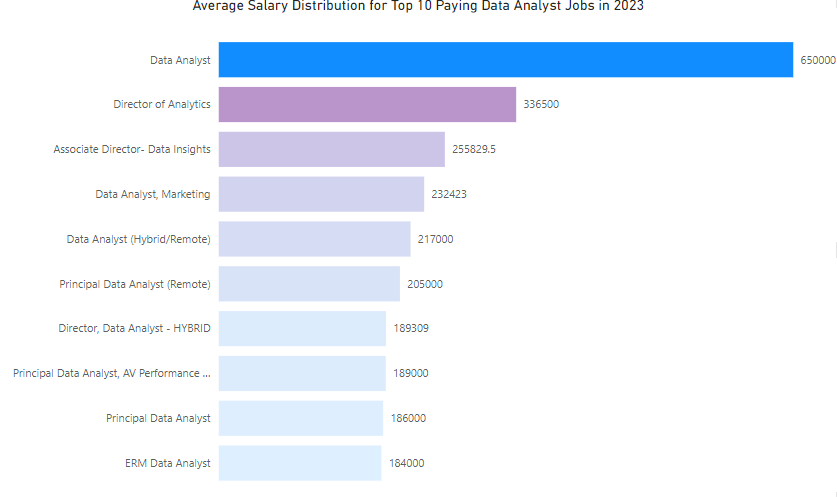
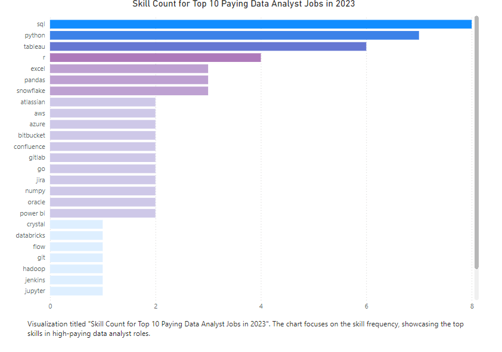
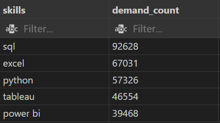
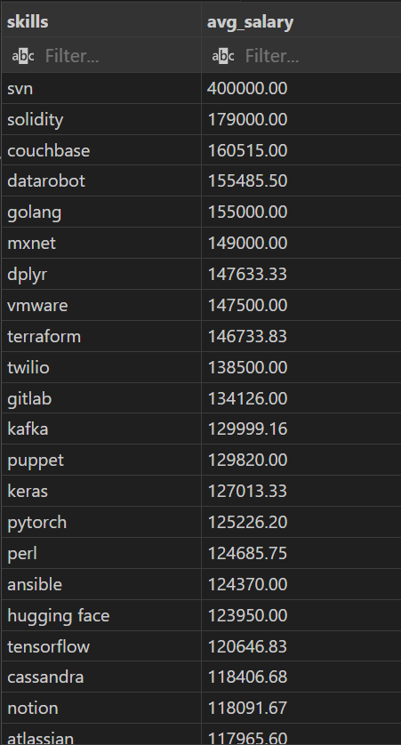
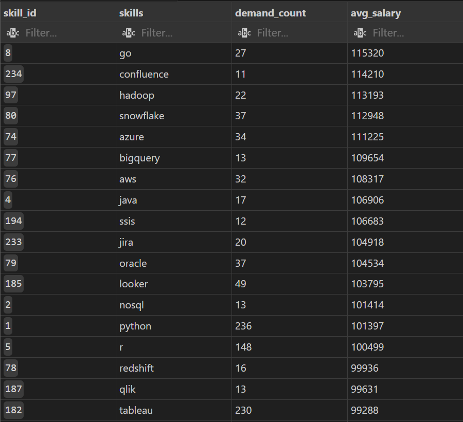

# Introduction
This project offers a snapshot of the data job market, specifically focusing on Data Analyst roles. It delves into the highest-paying positions, highlights the most sought-after skills, and uncovers the intersection where high demand aligns with lucrative salaries in data analytics.

Click for Sql queries here: [project_sql folder](/project_sql/)
# Background
This project was initiated to better understand the Data Analyst job market by identifying top-paying roles and the skills in highest demand. The goal is to discover the optimal skills needed for landing high-salary positions.

### Project Tasks:
- Identify the top-paying Data Analyst jobs.
- Determine the skills required for these high-paying roles.
- Analyze the most in-demand skills for Data Analysts.
- Explore which skills are linked to higher salaries.
- Highlight the most valuable skills to learn for career growth.

# Tools Used
To explore the Data Analyst job market, I utilized several key tools:

- **SQL:** The foundation of my analysis, enabling me to query databases and extract valuable insights.
- **PostgreSQL:** The database management system used to efficiently handle and analyze the dataset.
- **Visual Studio Code:** My go-to platform for managing the database and executing SQL queries.
- **Git & GitHub:** Essential for version control and sharing SQL scripts, ensuring collaboration and tracking project progress.

# Analysis
This project involved running targeted queries to investigate various aspects of the Data Analyst job market. Below is an overview of how each question was approached.

### 1. Top-Paying Data Analyst Jobs
To identify the highest-paying Data Analyst roles, I filtered positions based on average yearly salary, focusing specifically on remote jobs. This query provides insight into the best-paying opportunities within the field.


```sql
SELECT
    job_id,
    job_title,
    job_location,
    job_schedule_type,
    salary_year_avg,
    job_posted_date,
    name AS company_name
FROM
    job_postings_fact
LEFT JOIN company_dim ON job_postings_fact.company_id = company_dim.company_id
WHERE
    job_title_short = 'Data Analyst'
    AND job_location = 'Anywhere'
    AND salary_year_avg IS NOT NULL
ORDER BY
    salary_year_avg DESC
LIMIT 10
```
Here's the breakdown of the top data analyst jobs in 2023:
- **Wide Salary Range:** Top 10 paying Data Analyst roles span from $184,000 to $650,000, indicating significant salary potential in the field.
- **Diverse Employer:** Companies like SmartAsset, Meta, AT&T are among those offering high salaries, showing a broad interest across different industries.
- **Job Ttile Variety:** There's a high diversity in job titles, from Data Analyst to Director of Analytics, reflecting varied roles and specialization within Data Analytics.


Top Paying Roles
*Bar Graph visualizing the salary for the top 10 salaries for Data Aanlyst roles; Used Power BI for visualization.*

### 2.  Skills Required for Top-Paying Data Analyst Jobs
To uncover which skills are associated with the highest-paying Data Analyst positions, I first identified the top 10 roles based on average yearly salary. Then, I joined the skills dimension to see which skills are most commonly required for these positions. This query provides a clear understanding of the skills that top employers prioritize for their highest-compensated roles.

``` sql
WITH top_paying_jobs AS (
    SELECT
        job_id,
        job_title,
        salary_year_avg,
        name AS company_name
    FROM
        job_postings_fact
    LEFT JOIN company_dim ON job_postings_fact.company_id = company_dim.company_id
    WHERE
        job_title_short = 'Data Analyst'
        AND job_location = 'Anywhere'
        AND salary_year_avg IS NOT NULL
    ORDER BY
        salary_year_avg DESC
    LIMIT 10
)
SELECT 
    top_paying_jobs.*,
    skills_dim.skills
FROM top_paying_jobs
INNER JOIN skills_job_dim ON top_paying_jobs.job_id = skills_job_dim.job_id
INNER JOIN skills_dim ON skills_job_dim.skill_id = skills_dim.skill_id
ORDER BY
    salary_year_avg DESC
```

Breakdown for the top 10 most frequently mentioned skills for Data Analyst roles in 2023 which is based on job postings dataset are:

- **SQL** – 8 mentions
- **Python** – 7 mentions
- **Tableau** – 6 mentions
- **R** – 4 mentions
- **Snowflake** – 3 mentions
- **Pandas** – 3 mentions
- **Excel** – 3 mentions
- **Azure** – 2 mentions -- **Bitbucket** – 2 mention -- **Go** – 2 mentions


*Bar graph showing count of Skills for top Data Analyst jobs in 2023. Chart focuses on skill frequency showcaing the top skills in high paying data analyst roles.Used Power BI for visualization.*

### 3. Most In-Demand Skills for Data Analyst Roles
To determine the most sought-after skills for Data Analyst positions, I queried all job postings with the title "Data Analyst" and counted how often each skill was associated with these roles. This query ranks the top 5 skills based on demand, revealing which technical abilities are most valued in the job market.

``` sql
SELECT 
    skills_dim.skills,
    COUNT(skills_job_dim.job_id) AS demand_count
FROM job_postings_fact
INNER JOIN skills_job_dim ON job_postings_fact.job_id = skills_job_dim.job_id
INNER JOIN skills_dim ON skills_job_dim.skill_id = skills_dim.skill_id
WHERE
    job_title_short = 'Data Analyst'
GROUP BY
    skills_dim.skills   
ORDER BY
    demand_count DESC
LIMIT 5
```
Breakdown of the most indemand skills for data analysts in 2023
- Sql and Excel remain fundamental, emphasizing the need for strong foundational skills in data processing and manipulation.
- Programming and Visualization tools like Python, Tableau, and Power BI are essential, pointing towards the increasing importance of technical skills in data storytelling and decision support.


*This analysis highlights the most in-demand skills for Data Analyst roles, helping to identify the technical competencies that professionals should focus on acquiring or enhancing to remain competitive in the job market.*

### 4. Skills Associated with Higher Salaries
To understand which skills are linked to higher salaries, I analyzed the average salary for each skill mentioned in Data Analyst job postings. This query calculates the average salary for each skill and ranks them in descending order, providing insights into which skills tend to command higher compensation.

``` sql
SELECT
    skills,
    ROUND(AVG(salary_year_avg),2) AS avg_salary
FROM
    job_postings_fact
INNER JOIN skills_job_dim ON job_postings_fact.job_id = skills_job_dim.job_id
INNER JOIN skills_dim ON skills_job_dim.skill_id = skills_dim.skill_id
WHERE
    job_title_short = 'Data Analyst'
    AND salary_year_avg IS NOT NULL
GROUP BY
    skills
ORDER BY
    avg_salary DESC
LIMIT 30
```
Breakdown for top paying skills for Data Analyst:
-** High Demand for Big Data and ML Skills:** AI and machine learning frameworks like MXNet, Keras, and PyTorch command high salaries, reflecting the importance of expertise in data handling and machine learning.
- **Software Development and Deployment Proficiency:** Skills such as SVN and Solidity stand out for software version control and blockchain development, both of which are associated with high-paying roles.
- **Cloud Computing Expertise:** Tools like VMware, Terraform, and Puppet highlight the critical need for cloud infrastructure management and automation skills in today's data-driven landscape.


*This analysis reveals the top skills that are associated with the highest average salaries for Data Analyst roles, helping to identify which technical proficiencies can significantly boost earning potential.*

### 5.Optimal Skills to Learn for High Demand and High Salary in Remote Data Analyst Roles
This query focuses on remote Data Analyst positions and combines two key aspects: demand and salary. The first part calculates the demand for each skill by counting how often it appears in job postings. The second part calculates the average salary associated with each skill. Finally, the query merges these results to highlight the top 25 skills that meet the following conditions:
High Demand (more than 10 job postings)
High Salary (ranked by average salary)
This analysis is valuable for identifying skills that not only have strong demand but also correlate with high compensation in remote Data Analyst roles.

```sql
WITH skills_demand AS ( 
    SELECT
        skills_dim.skill_id,
        skills_dim.skills,
        COUNT(skills_job_dim.job_id) AS demand_count
    FROM job_postings_fact
    INNER JOIN skills_job_dim ON job_postings_fact.job_id = skills_job_dim.job_id
    INNER JOIN skills_dim ON skills_job_dim.skill_id = skills_dim.skill_id
    WHERE
        job_title_short = 'Data Analyst'
        AND salary_year_avg IS NOT NULL
        AND job_work_from_home = True
    GROUP BY
        skills_dim.skill_id
), average_salary AS (
    SELECT
        skills_job_dim.skill_id,
        ROUND(AVG(salary_year_avg),0) AS avg_salary
    FROM job_postings_fact
    INNER JOIN skills_job_dim ON job_postings_fact.job_id = skills_job_dim.job_id
    INNER JOIN skills_dim ON skills_job_dim.skill_id = skills_dim.skill_id
    WHERE
        job_title_short = 'Data Analyst'
        AND salary_year_avg IS NOT NULL
        AND job_work_from_home = True
    GROUP BY
        skills_job_dim.skill_id
)

SELECT
    skills_demand.skill_id,
    skills_demand.skills,
    demand_count,
    avg_salary
FROM
    skills_demand
INNER JOIN average_salary ON skills_demand.skill_id = average_salary.skill_id
WHERE
    demand_count > 10
ORDER BY
    avg_salary DESC,
    demand_count DESC
LIMIT 25
```
Breakdown for Optimal Skills for Data Analysts in 2023:
- **Cloud and Big Data Skills Lead:** Technologies like Snowflake, Azure, BigQuery, and AWS appear frequently, showcasing the increasing demand and high salaries for cloud computing and big data management skills.

- **Versatile Programming:** Go and Java are valued programming languages, commanding respectable salaries, with Go offering an average of $115,320 across 27 job postings.

- **BI Tools in Demand:** Business Intelligence tools like Tableau (230 postings) and Looker (49 postings) show high demand, although their average salaries are slightly lower, indicating broad but less specialized usage.

- **Data Engineering Expertise:** Tools like Hadoop, SSIS, and Redshift continue to show demand and solid pay, emphasizing the importance of data engineering skills in the job market.


*This final analysis provides a comprehensive look at the top skills that are both in high demand and associated with higher-than-average salaries for remote Data Analyst roles. These insights can guide professionals in selecting the most valuable skills to enhance for better opportunities in the job market.*

# Personal Key Takeaways from what I learned from the  project :

- **Crafting Complex Queries:** I gained valuable experience in building complex SQL queries, using JOINs and CTEs to efficiently retrieve and analyze job market data.

- **Data Aggregation and Analysis:** Through advanced data aggregation techniques, I was able to extract meaningful insights from large datasets, such as identifying high-demand skills and top-paying roles.

- **Developing Analytical Skills:** This project helped sharpen my analytical skills by interpreting the results of queries, identifying trends in the data, and transforming raw information into actionable insights.

# Conclusions

## Insights
- **Top-Paying Data Analyst Jobs:** The highest-paying remote data analyst roles reveal a wide salary range, with top positions offering up to $650,000. Remote roles with specialized skills, such as those requiring advanced machine learning or cloud expertise, tend to offer the most lucrative opportunities.
- **Skills for Top-Paying Jobs:** The most highly compensated data analyst positions consistently demand advanced skills in SQL, Cloud Computing, and Machine Learning, emphasizing the importance of technical proficiency in these areas. Skills such as SVN, Solidity, and Couchbase top the list for average salary, demonstrating a trend toward specialized and niche technologies.
- **Most In-Demand Skills:** Python, SQL, and Tableau emerge as the most in-demand skills for data analysts, with Python leading at 236 job postings. These skills are critical for roles that focus on data manipulation, visualization, and overall data-driven decision-making processes, highlighting the ongoing need for versatile data tools.
- **Skills Associated with Higher Salaries:** Advanced skills in Big Data, Cloud Computing, and DevOps tools like Terraform, Golang, and VMware are consistently linked to higher average salaries. These specialized technologies help data analysts manage infrastructure and optimize data workflows, resulting in higher compensation for those proficient in these areas.
- **Optimal Skills to Learn:** For aspiring data analysts, focusing on high-demand skills like Python, SQL, and Cloud Technologies will provide the best career opportunities. Additionally, developing proficiency in machine learning frameworks such as Keras and Pytorch can significantly boost earning potential in the rapidly evolving field of data analytics.